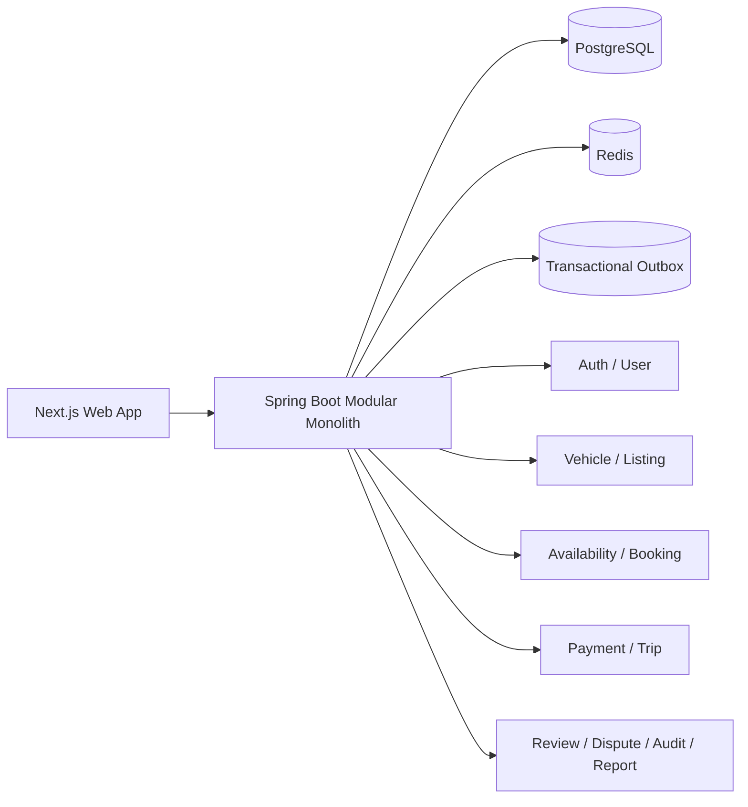
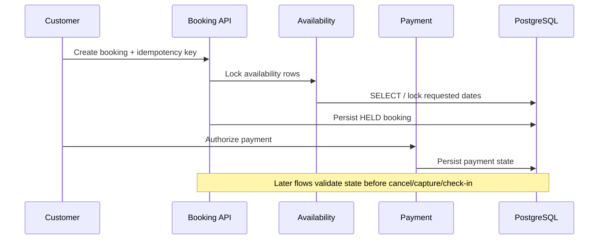

# RentFlow

**Full-stack car-rental marketplace focused on transactional booking correctness, payment lifecycle safety, and production-oriented backend design.**

<p>
  
  
  
  
  
  
</p>

> RentFlow is not just a CRUD booking demo. The project explores the parts that usually become difficult in a real marketplace: inventory/availability races, idempotent booking creation, payment mutations, state transitions, authorization boundaries, auditability, and regression safety.

## Product at a Glance

RentFlow models a two-sided rental marketplace with customer, host, and admin flows.

- **Customers** can discover listings, check availability, create bookings, authorize payments, follow trip state, review rentals, and open disputes.
- **Hosts** can manage vehicles, listings, availability, media, and booking-related operations.
- **Admins** can approve listings, manage users, review operational states, and resolve protected workflows.
- **Backend workflows** cover auth, booking, payment, trip lifecycle, notifications, audit, reporting, and transactional outbox delivery.

## Engineering Signals

| Area | What the project demonstrates |
|---|---|
| **Booking correctness** | Idempotent booking creation, overlap prevention, pessimistic availability locking, hold expiry, and guarded cancellation paths |
| **Payment lifecycle** | Authorization, capture, void, refund/reconciliation-oriented state with transaction hardening around mutations |
| **State machines** | Explicit lifecycle rules across listings, bookings, trips, disputes, and payments rather than free-form status updates |
| **Persistence** | PostgreSQL + Flyway migrations with constraints and repository-level transaction boundaries |
| **Reliability** | Transactional outbox, retry-oriented infrastructure, correlation-aware API errors, and release-gate hardening |
| **Testing** | Unit tests plus Testcontainers-backed integration coverage for real PostgreSQL behavior |
| **Security** | JWT/RBAC, refresh-token handling, stricter non-local secrets, protected admin operations, and safer local cookie policy |
| **Full-stack delivery** | Spring Boot API plus Next.js flows for public browsing, host operations, booking/payment, and admin screens |

## Architecture



The backend is intentionally kept as a **modular monolith**: domain boundaries are explicit, while transaction-heavy workflows can still coordinate safely inside one database transaction.

## Core Modules

```text
com.rentflow
├── auth          # register, login, refresh, logout, JWT/RBAC
├── user          # profile and user data
├── vehicle       # vehicle lifecycle
├── listing       # listing lifecycle, search, admin approval
├── availability  # host blocks, calendar, reservation locking
├── booking       # holds, cancellation, expiry, idempotency
├── payment       # authorize/capture/void/refund-related flows
├── trip          # check-in/check-out lifecycle
├── review        # reviews and rating aggregation
├── dispute       # customer dispute + admin resolution
├── notification  # in-app notifications
├── audit         # sensitive-action audit trail
├── outbox        # transactional outbox + retry path
├── report        # operational/revenue reporting
└── common        # security, config, errors, shared web concerns
```

## Booking Flow



The important part is not the diagram itself: booking operations are designed around **race conditions and invalid transitions**, not only happy-path request handling.

## Tech Stack

| Layer | Technology |
|---|---|
| Backend | Java 17, Spring Boot 3.3 |
| Frontend | Next.js |
| Database | PostgreSQL 16 |
| Migrations | Flyway |
| Cache / session support | Redis 7 |
| API contract | SpringDoc OpenAPI |
| Testing | JUnit 5, Mockito, Testcontainers, MockMvc |
| Build | Maven |
| Local infrastructure | Docker Compose |

## Run Locally

### Prerequisites

- Java 17
- Docker + Docker Compose
- Maven 3.9+ or the included Maven wrapper

### Fast path on Windows

```powershell
.\scripts\dev-backend.ps1
```

The helper checks Docker, starts PostgreSQL/Redis when needed, waits for the ports, and launches the backend.

### Manual path

```bash
docker compose up -d
./mvnw spring-boot:run
```

Useful endpoints:

| Endpoint | Purpose |
|---|---|
| `http://localhost:8087/swagger-ui.html` | Swagger UI |
| `http://localhost:8087/api-docs` | OpenAPI JSON |
| `http://localhost:8087/api/v1/health` | Application health |
| `http://localhost:8087/actuator/health` | Actuator health |

## Tests

```bash
# Fast unit-test suite
mvn test

# PostgreSQL-backed integration tests (Docker required)
mvn verify -Pintegration-tests

# Example targeted test
mvn test -Dtest=HealthControllerTest
```

Integration coverage uses Testcontainers to exercise behavior against a real PostgreSQL instance rather than relying only on mocks or H2 semantics.

## Current Status

Implemented backend domains include auth/user, vehicle/listing, availability, booking, payment, trip lifecycle, review, dispute, notifications, audit, outbox, and reporting.

The current hardening track focuses on regression safety, API/documentation consistency, and release-gate evidence. Booking cancellation and payment transaction hardening are already covered by backend regression work; UX and contract polish continue incrementally.

For the active implementation roadmap, see [`docs/roadmap.md`](docs/roadmap.md).

## Local Configuration

The `local` Spring profile provides development-only defaults so a new checkout can boot without manually provisioning secrets. Non-local environments remain strict and require explicit JWT, encryption, and signed-URL secrets.

Common local variables:

| Variable | Default |
|---|---|
| `DB_HOST` | `localhost` |
| `DB_PORT` | `5433` |
| `DB_NAME` | `rentflow` |
| `DB_USER` | `rentflow` |
| `DB_PASSWORD` | `rentflow` |
| `SPRING_PROFILES_ACTIVE` | `local` |

## Repository Notes

This repository also contains architecture/refactor notes and AI-assisted development rules used to keep implementation boundaries explicit. They are supporting material; the code, tests, runtime behavior, and documented constraints remain the primary evidence for the project.

## License

MIT
